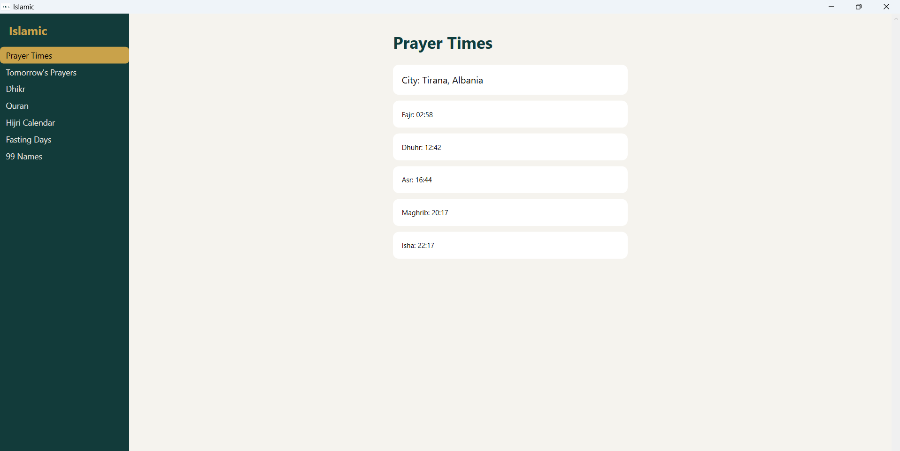
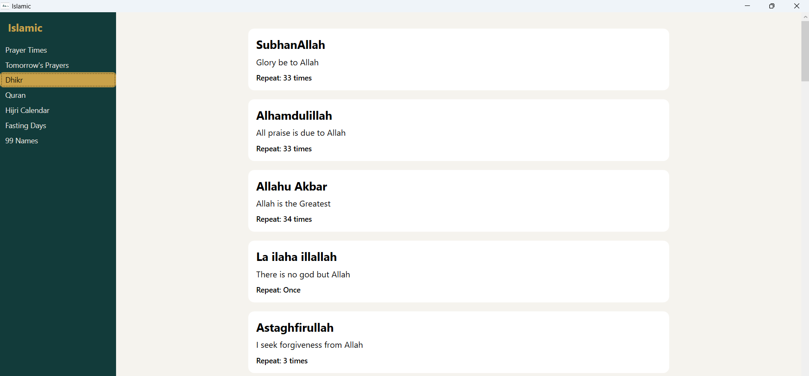
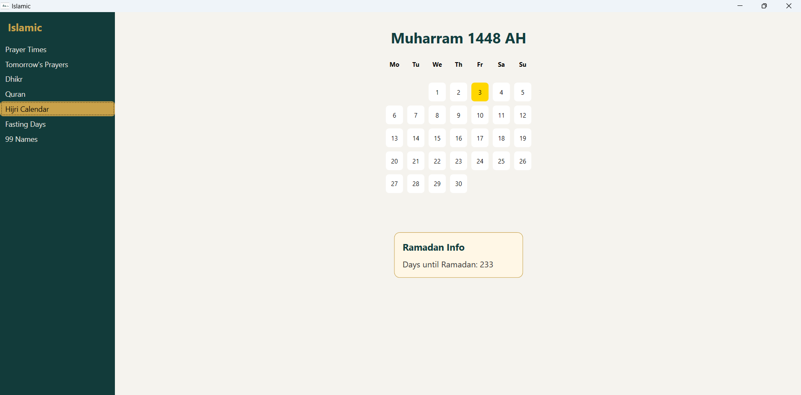

# Islamic


Islamic is a simple, cross-platform command-line application and desktop application (for Windows 10 and 11) written in C# that provides daily Islamic utilities directly in the terminal and also as a desktop application. It focuses on prayer times, dhikr, Qur'an reading, and Hijri dates, all fetched automatically based on your location without manual configuration.

1. Prayer times


2. Adhkar(remembrance)


3. Hijri calendar


## Features of Islamic and Islamic.Cli

- Automatic prayer times based on your location (via Latitude and Longitude)
- Display today’s full prayer schedule
- Show the next upcoming prayer
- A list of common Adhkar
- Qur'an reading
- Notifies 10 minutes before each prayer using an Adhan and a system notification.
- Cross-platform support (Windows, Linux, macOS Intel & Apple Silicon)
- Lightweight, fast, no external dependencies

## Installation of the desktop application

Go to the releases page and download the latest version of Islamic.Desktop for Windows 10 or 11. Run the installer and follow the instructions.

## Installation of the CLI application

Download the binary for your operating system and place it in a directory included in your PATH.

### macOS / Linux
```bash
chmod +x islamic
sudo mv islamic /usr/local/bin/
```

### Windows (PowerShell)

Place islamic.exe in a folder that is included in your PATH.

### Usage

## Show today’s prayer times:

``` islamic pray ```

## Show tomorrow's prayer times:

``` islamic pray --tomorrow  ```

## Show the next prayer:

``` islamic pray --next ```

## Notify 10 minutes before each prayer using an Adhan sound and a system notification:

``` islamic notify ```

## Show a list of common adhkar:

``` islamic dhikr ```

## Show a random dhikr:

``` islamic dhikr --random ```

## Read a Surah from the Qur'an:

``` islamic quran 1 ```

until 114. Choose your Surah with its number.

## Show the current Hijri month with month name transliterated, and the current day highlighted:
This command also shows how many days are left until Ramadan begins and a Ramadan Mubarak message with how many days are left from Ramadan and in which day we currently are.

``` islamic hijri ```

## Show recommended fasting days(weekly and monthly with a reminder if it is the current day):

``` islamic fasting-days ```

## Show the 99 Beautiful Names of Allah

``` islamic 99  ```

### Data Sources

Prayer times: AlAdhan API

Dhikr: Local JSON file

Qur'an: Local JSON file

Adhan: Local mp3 file

Hijri: HijriCalendar class from .NET library

### Philosophy

Islamic aims to be minimal, respectful, and distraction-free.
No tracking, no ads, no unnecessary complexity.

Built for Muslims who live in the terminal.
