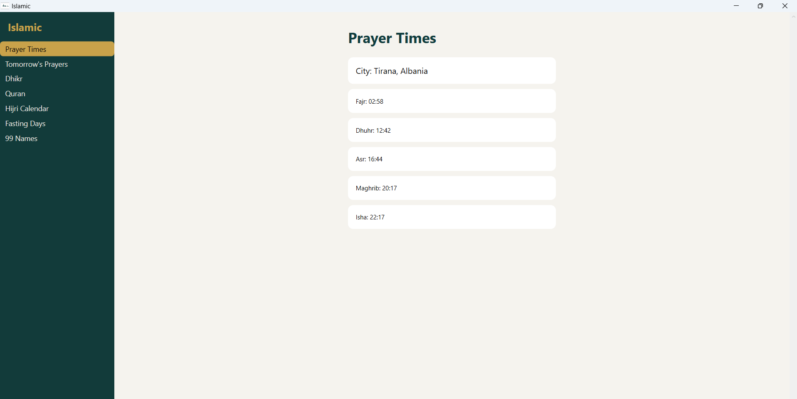
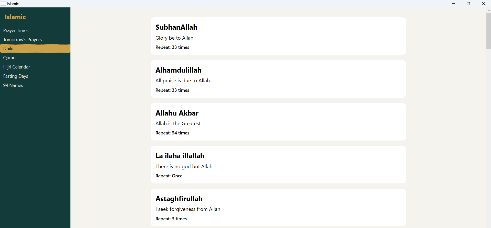
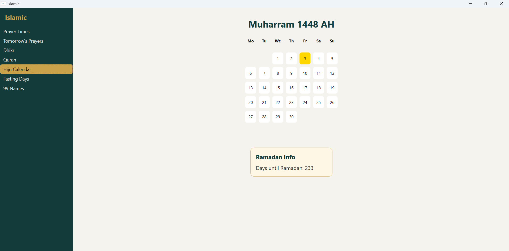

# Islamic

Islamic is a simple, Linux desktop application written in Java that provides daily Islamic utilities. It focuses on prayer times, dhikr, Qur'an reading, and Hijri dates, all fetched automatically based on your location without manual configuration.

1. Prayer times

2. Adhkar(remembrance)

3. Hijri calendar

## Features of Islamic and Islamic.Cli

- Automatic prayer times based on your location (via Latitude and Longitude)
- Display today’s full prayer schedule
- Show the next upcoming prayer
- A list of common Adhkar
- Qur'an reading
- Notifies 10 minutes before each prayer using an Adhan and a system notification.
- Cross-platform support (Windows, Linux, macOS Intel & Apple Silicon)
- Lightweight, fast, no external dependencies

## Installation of the desktop application

Go to the releases page and download the latest version of Islamic.Desktop for Windows 10 or 11. Run the installer and follow the instructions.

### Data Sources

Prayer times: AlAdhan API

Dhikr: Local JSON file

Qur'an: Local JSON file

Adhan: Local mp3 file

Hijri: HijriCalendar class from .NET library

### Philosophy

Islamic aims to be minimal, respectful, and distraction-free.
No tracking, no ads, no unnecessary complexity.

Built for Muslims who live in the terminal.
