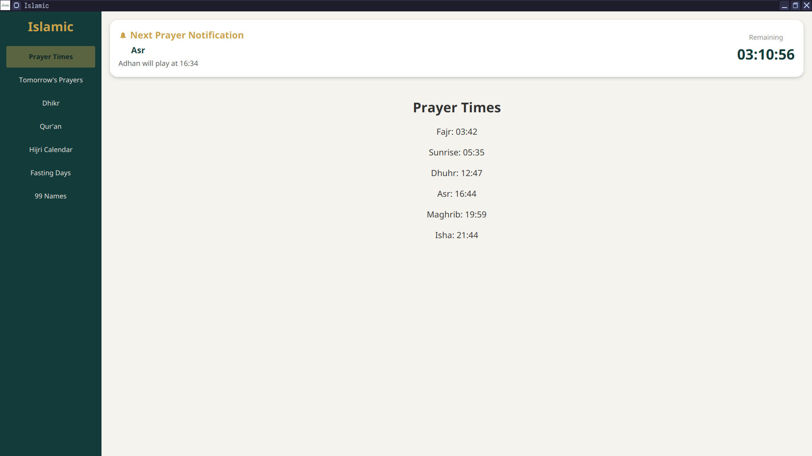
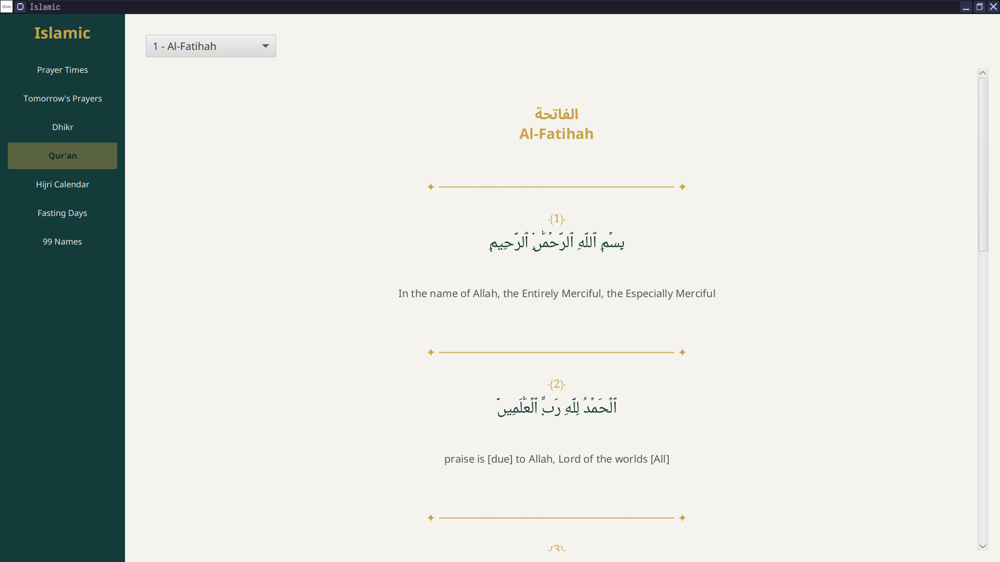
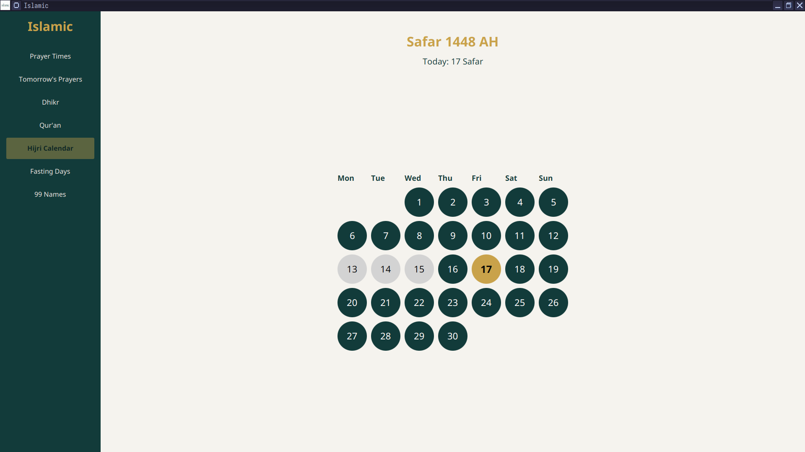
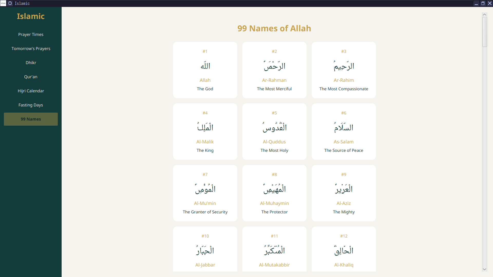

# Islamic

Islamic is a simple, Linux desktop application written in Java that provides daily Islamic utilities. It focuses on prayer times, dhikr, Qur'an reading, and Hijri dates, all fetched automatically based on your location without manual configuration.

1. Prayer times and the notifier

2. Qur'an

3. Hijri calendar

4. 99 Names of Allah SWT

## Features of Islamic

- Automatic prayer times based on your location (via IP Address, Latitude and Longitude)
- Display today’s full prayer schedule
- Show the next upcoming prayer
- Notify using Adhan and system notification 10 minutes before each prayer
- A list of common Adhkar
- Qur'an reading
- Notifies 10 minutes before each prayer using an Adhan and a system notification.

## Installation of the desktop application

Go to the releases page and download the latest version of Islamic.Desktop for Linux. Run the installer and follow the instructions.

### Data Sources

Prayer times: AlAdhan API

Dhikr: Local JSON file

Qur'an: Local JSON file

Adhan: Local mp3 file

Hijri: HijrahDate class from Java library

### Philosophy

Islamic aims to be minimal, respectful, and distraction-free.
No tracking, no ads, no unnecessary complexity.

Built for Muslims who live in Linux.

## Legacy

For the legacy version, go into the folder named C#, there you will find the CLI version and the Windows desktop version.

## License

GPLv3

